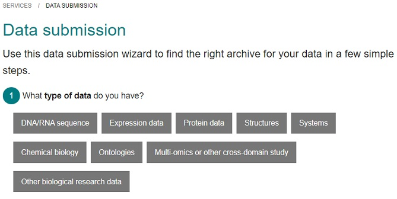

## Why submit your datasets to a repository?
### Why should I share my data?
* Open Science & FAIR - To meet the requirements from funders and society on Open Science & FAIR
* Reproducibility - So that your published research results can be reproduced
* Trail of evidence - To provide a provenance of the data
* 3rd party access - To give others access to your data
* Archival purposes - Research data should be available for as long as it is useful to someone
* Publication of paper requires it - Nowadays most publishers require you to submit the data to a repository when publishing a paper

### FAIR data
Data publication is the best way to make your research projects FAIR since your data becomes:
* **Findable** by being assigned a persistent identifier, and by being described with rich metadata.
* **Accessible** by being put in a resourse that is searchable, and enables easy access via internet
* **Interoperable** by using standard format and language to represent both the data and its metadata
* **Reusable** by fulfilling the F, A, and I, and by having a clear and accessible data usage license

### What data should be submitted?
* Raw data: this is the data that comes straight from the instrument, eg RNA sequences in fastq format
* Processed & analysis data: this is the data where some type of analysis or processing has been done, eg normalization, removal of outliers, expression measurements, statistics
* Metadata: this is the description of the raw and processed data, eg in the form of minimum information to reproduce the data, sample information, precise protocols

## How to find a suitable repository
### Types of repositories
* Domain-specific: 
    * Best choice if suitable, long-term plan, typically free of charge, maximum reach 
    * E.g. [European Nucleotide Archive](https://www.ebi.ac.uk/ena/browser/home), [ArrayExpress](https://www.ebi.ac.uk/arrayexpress), [PRIDE](http://www.ebi.ac.uk/pride)
* General purpose: 
    * Second best, long-term plan, might cost (now or in future), good reach but less specific in metadata → more difficult for future users to judge if a dataset will be useful
    * E.g. [Zenodo](https://zenodo.org/), [(SciLifeLab) Figshare](https://scilifelab.figshare.com/), [Dryad](https://datadryad.org/)
* In-house/institutional
    * For archive/backup purpose mainly, might cost, limited reach unless also published in data catalogue

### How find a domain-specific repository?
* [EBI repository wizard](https://www.ebi.ac.uk/submission/) - guide depending on data type
* [ELIXIR deposition databases](https://elixir-europe.org/platforms/data/elixir-deposition-databases) - core resources with long-term data preservation and accessibility plans
* [FAIRsharing.org/databases](https://fairsharing.org/databases/) - catalogue of many repositories, with possibility to filter on e.g. domain
* [Scientific Data Repository Guidance](https://www.nature.com/sdata/policies/repositories#life) - publisher’s recommendation

## EBI Repository Wizard

[EBI](https://www.ebi.ac.uk/) hosts several life science repositories, suitable for different types of data. The Repository Wizard helps to identify which one is suitable for your data.

* Go to the Wizard at [https://www.ebi.ac.uk/submission/](https://www.ebi.ac.uk/submission/)

  > ## Picture
  > 
  {: .solution}

* Either explore the wizard with the purpose of finding a suitable repository for one of your projects, or choose among the scenarios provided below. Which repository is recommended?

  * Genomics project with RNA sequences
  * X-ray chrystollography structure of a protein
  * Gene expression data
  * Protein sequencing data
  * Proteomics project using mass spectrometry
  * Electron microscopy structure images

  > ## Solution
  > * Genomics project with RNA sequences: [European Nucleotide Archive](https://www.ebi.ac.uk/ena/browser/submit) (DNA/RNA sequence -> no controlled access -> produced experimentally -> Other)
  > * X-ray chrystollography structure of a protein: [wwPDB OneDep](https://deposit-pdbe.wwpdb.org/deposition) (Structures -> X-ray chrystollography)
  > * Microarray gene expression data: [ArrayExpress](https://www.ebi.ac.uk/arrayexpress/submit/overview.html) (Expression data -> no controlled access -> Microarray gene expression)
  > * Protein sequencing data: [UniProt SPIN](https://www.ebi.ac.uk/swissprot/Submissions/spin/) (Protein data -> no controlled access -> produced experimentally -> Protein sequencing)
  > * Proteomics project using mass spectrometry: [PRIDE](https://www.ebi.ac.uk/pride/markdownpage/submitdatapage) (Protein data -> no controlled access -> produced experimentally -> Mass spectrometry -> Proteomics)
  > * Electron microscopy structure images: [EMPIAR](https://www.ebi.ac.uk/pdbe/emdb/empiar/deposition/) (Structures-> Electron microscopy -> micrographs or particle stacks)
  {: .solution}



